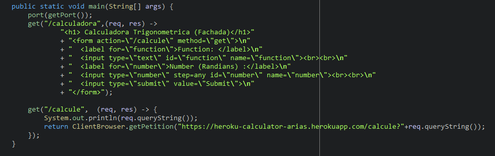
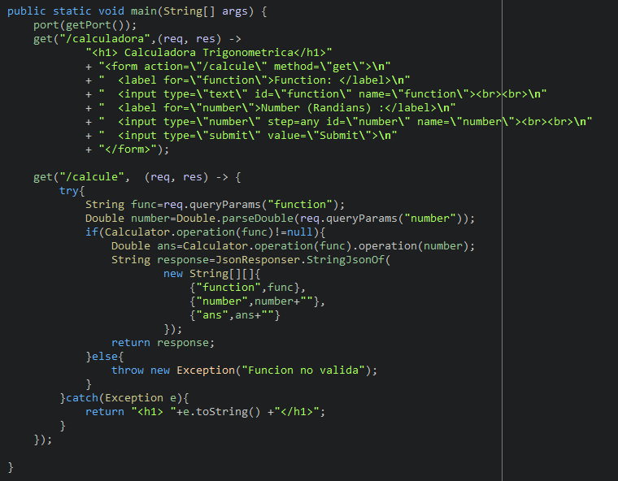

# Taller

#  Heroku Facade & Client

# Fachada Heroku

https://heroku-facade-arias.herokuapp.com/calculadora

# Calculadora Heroku

https://heroku-calculator-arias.herokuapp.com/calculadora


## Para correr las prueba : (paquete Client , clase ClientBrowser main )

```
java $JAVA_OPTS -cp target/classes:target/dependency/* edu.escuelaing.arep.herokufacade.Client.ClientBrowser
```




